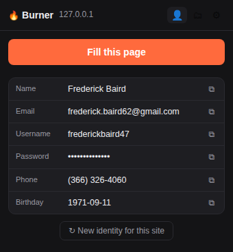
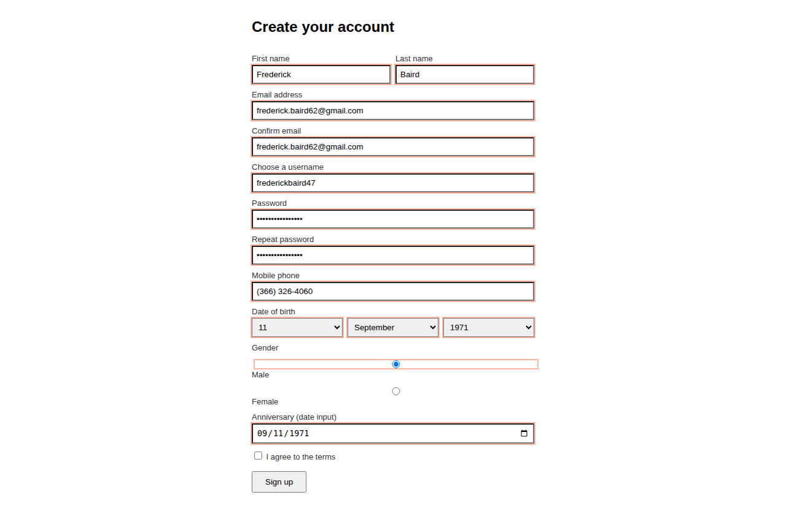

<p align="center">
  
</p>

<p align="center">
  <a href="https://burner-ext.vercel.app"><b>Live demo</b></a> ·
  <a href="#install">Install</a> ·
  <a href="#email-modes">Email modes</a> ·
  <a href="#how-it-works">How it works</a>
</p>

<p align="center">
  
  
  
</p>

One click fills any signup form with a fake identity — and the **same site always gets the same identity**, so you can log back in later. Powered by [phoney](https://github.com/rar-file/phoney)'s locale data. 100% local: no account, no server, no telemetry.

<p align="center">
  
</p>

## Why

Every site wants your name, email, phone and birthday. None of them need it.

- **Consistent per site** — personas are derived deterministically from one master seed + the domain. Revisit netflix.com next year, Burner shows the same Daryl Abbott with the same password.
- **Traceable emails** — in tagged mode your email becomes `you+netflix.k3f@gmail.com`. Mail still arrives, and when spam shows up on that address you know exactly who leaked it. The Sites tab keeps the receipt.
- **Nothing stored anywhere** — identities are math, not data. Back up the 32-char seed and you can recreate every persona on a new machine.

## Install

1. `chrome://extensions` → enable Developer mode → **Load unpacked** → pick the `extension/` folder.
2. Pin the icon. Open any signup page, click the icon, hit **Fill this page**. Done.

Right-click → "Fill with Burner" and `Alt+Shift+B` also work.

## Email modes

| Mode | Example | Receives mail | Leak-traceable |
|---|---|---|---|
| Fully fake (default) | `daryl.abbott65@yahoo.com` | no | no |
| My email + tag | `you+netflix.k3f@gmail.com` | yes | yes |
| Catch-all domain | `netflix.k3f@mydomain.com` | yes | yes, and your real address stays private |

## What gets filled

First/last/full name, email + confirm, username, password + confirm, phone (locale-formatted, validator-safe), date of birth (inputs, dropdowns, or `type=date`), gender (selects and radios). Checkboxes are never touched — agreeing to terms is your job.

<p align="center">
  
</p>

17 name locales from phoney (en_US, en_GB, de_DE, fr_FR, ja_JP, ko_KR, zh_CN, hi_IN, ar, ru, …).

## How it works

`SHA-256(masterSeed : site : counter)` seeds an sfc32 PRNG; every persona field is drawn from that stream. "New identity" just bumps the counter for that site. The content script is injected only when you click (activeTab) — the extension has no host permissions and reads no pages on its own.

Passwords are re-derivable from the seed, but this is not a password manager — no breach checks, no rotation, no sync. Use it for accounts you don't care about; that's the point.

## Development

```
python3 tools/build_data.py [path-to-phoney]   # rebuild data bundle from phoney
node test/generator.test.mjs                   # unit tests
python3 test/e2e.py                            # Playwright: loads the extension in
                                               # Chromium and drives the real popup
```

The landing page in `site/` (deployed to Vercel) runs the real generator in-browser; `site/generator.js` and `site/personas.json` are copies of the extension's — re-copy them if you change either.

Heads-up: the draw order in `lib/generator.js` is a compatibility contract — reordering it changes every user's personas.

## Roadmap

- Addresses (street/city/zip) — phoney has the data
- Firefox port (MV3 is close; `chrome.*` → `browser.*` shim)
- Per-site field overrides when detection guesses wrong
- Web store listing

MIT, same as phoney.
